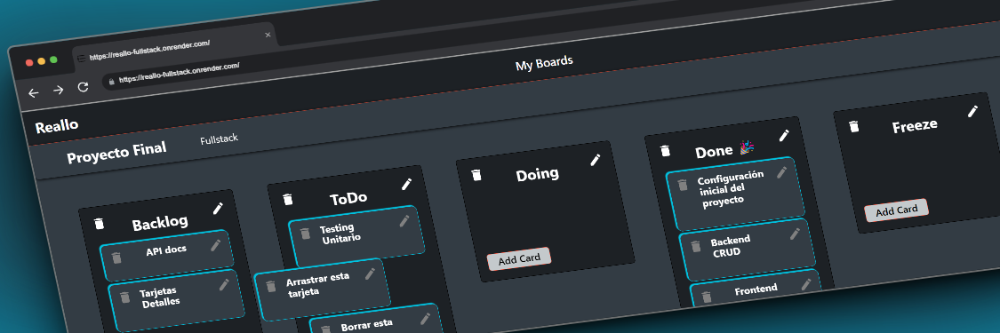
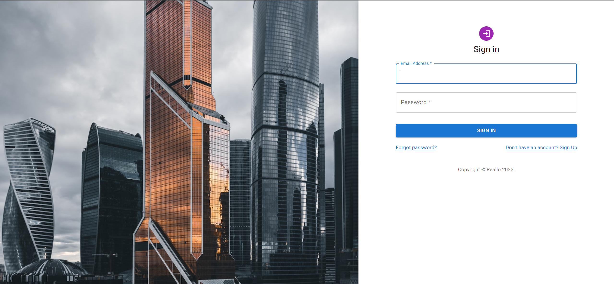
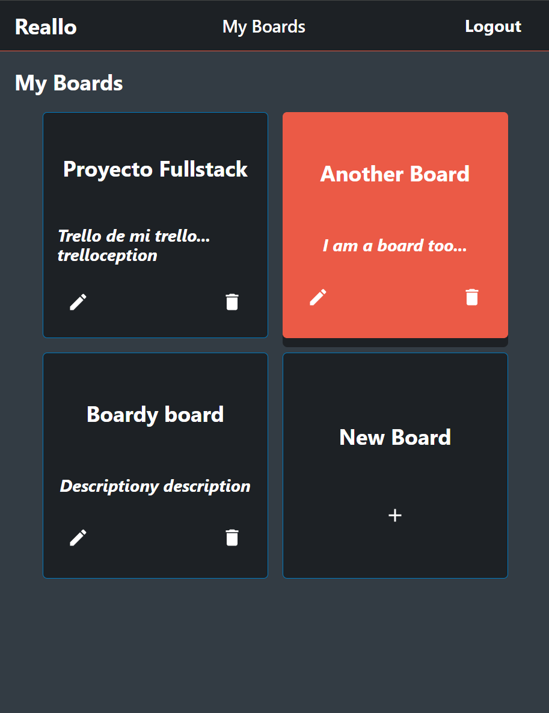
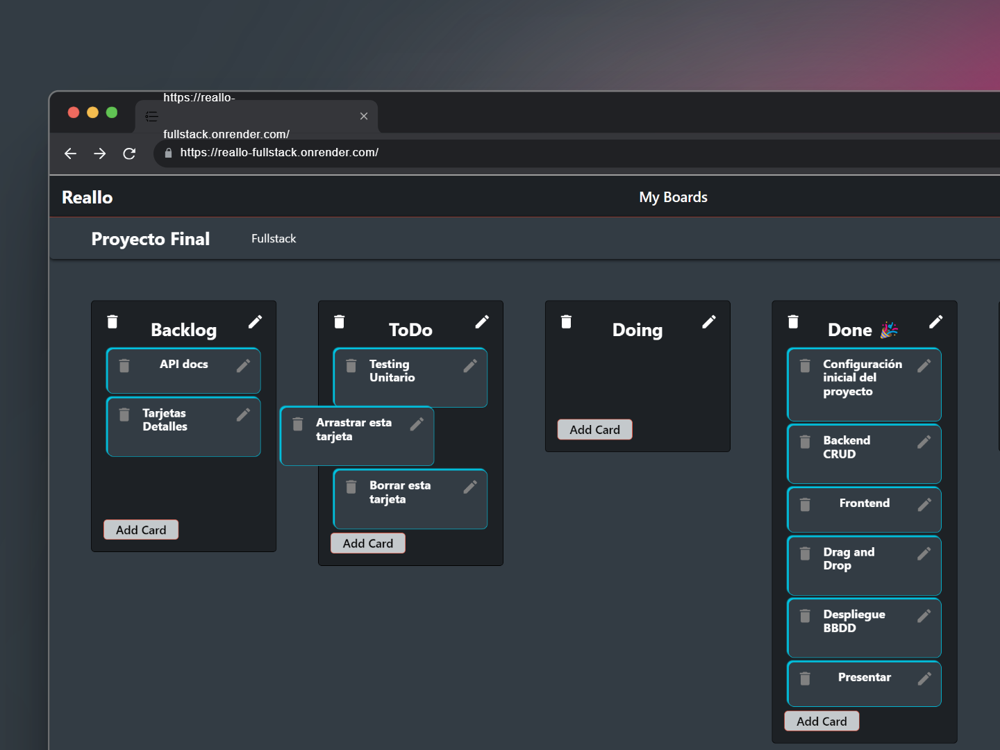
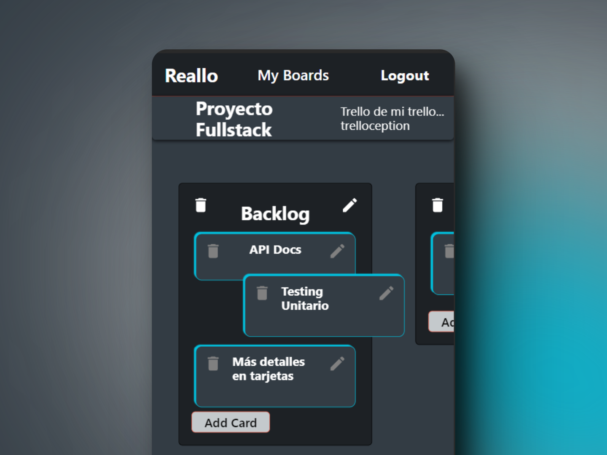
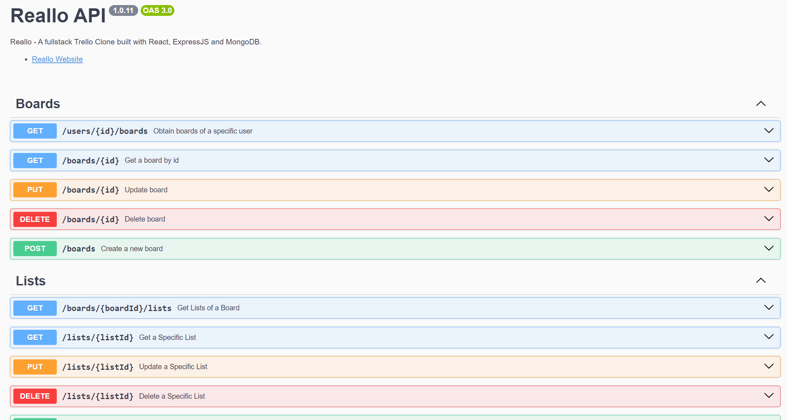
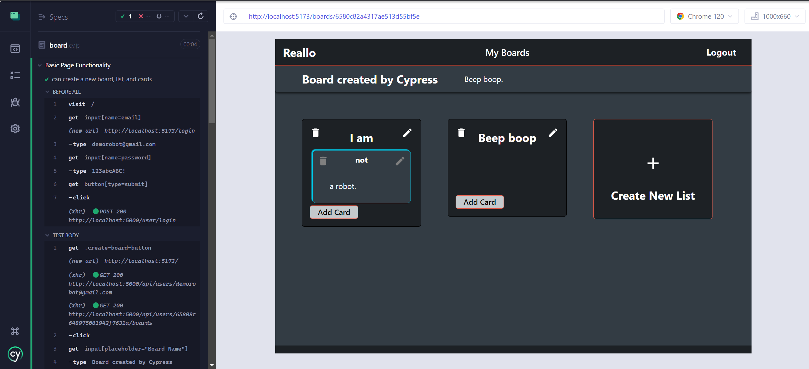

   
    
   
  

# Reallo: Task and Project Management Web App

[Reallo](https://reallo-fullstack.onrender.com/) is a full-stack application inspired by Trello. Reallo offers a dynamic, user-friendly interface for managing tasks and projects. Built with React, Express, MongoDB, and Node.js.
Project presentation (in spanish) [here](https://www.canva.com/design/DAF3X13sgTk/IQ_TRG93Xi9Tkexf9WvxPA/view?utm_content=DAF3X13sgTk&utm_campaign=designshare&utm_medium=link&utm_source=editor).

## Features

- **Board Management**: Users can create, update, and delete boards to organize various projects.
- **List and Card System**: Within each board, users can create lists and add cards with short descriptions representing individual tasks or items.
- **Drag-and-Drop Interface**: Intuitive drag-and-drop functionality for moving cards across and between lists.
- **User Authentication**: Secure login and registration system using Json Web Token for a personalized user experience.
- **Real-Time Data Interaction**: Utilizes Axios for efficient communication with the backend API. All the data is stored and updated in real time using a MongoDB database.
- **Responsive Design**: Adaptable interface for a consistent experience across different devices.
- **Confetti!**: Special emoji recognition that triggers a celebratory confetti animation. Try to guess a way to trigger it!
- **Toast Notifications**: Beautiful notifications using [React Hot Toast](https://github.com/timolins/react-hot-toast).
- **E2E Testing**: Workflow tested using Cypress.
- **API Documentation**: API endpoints documented using Swagger.
- **Deployment on Render**: Using a Docker container.

https://reallo-fullstack.onrender.com/
(If not responding, give it a moment for render to initialize...)

## Web Preview

### User Auntentication

Secure login and registration system using Json Web Token for a personalized user experience. Custom notifications for login, logout and register events using [React Hot Toast](https://github.com/timolins/react-hot-toast).

 

### Board Interaction

Users can create multiple boards, each representing a different project or category. Lists and cards within these boards can be easily managed.

### Drag-and-Drop Functionality

Intuitive drag and drop functionality to move cards through and between lists.

## API Documentation

API endpoints documented using Swagger.

## Cypress E2E Testing

End to end testing done with Cypress to test a basic user workflow of login --> board create --> navigate to board --> create lists --> create cards.

## Built With

- [React](https://reactjs.org/) - The web framework used
- [Express](https://expressjs.com/) - Backend framework
- [MongoDB](https://www.mongodb.com/) - Database
- [Node.js](https://nodejs.org/) - JavaScript runtime
- [SASS](https://sass-lang.com/) - For styling
- [React Beautiful DnD](https://github.com/atlassian/react-beautiful-dnd) - Drag-and-drop functionality
- [Cypress](https://www.cypress.io/) - End-to-end testing

## Authors

- **Alejandro Sanchez** - [AxelothLeohryn](https://github.com/AxelothLeohryn)

Thank you for taking a look at my project ❤️! Feel free to contribute or suggest improvements. I will continue updating the project to add features and refine functionality, mostly as a learning experience.
